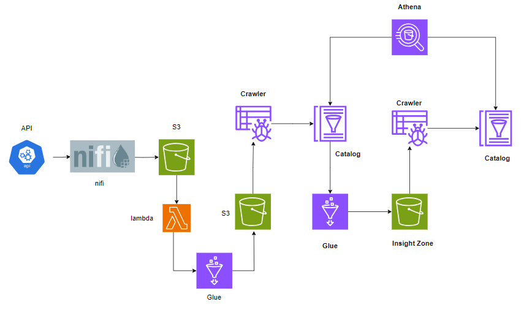

# Realtime Streaming Flights-Data-Pipeline ( With AWS )
A project in Big Data Analysis and Business Intelligence course in HCMUT.

## Reference
* My work inspired by this [REPO](https://github.com/XSiddhSaraf/Covid-19-Data-Pipeline-Based-On-Messaging-and-Analysis)

## Brief Description
> [!CAUTION]
> AWS provides all tools to build a full data pipeline. However, some of its tools are not free, becareful to use it.

We first collect realtime streaming data from "http://api.aviationstack.com" for every 5 minutes into ecosystem using NiFi and to process it and store it in the data lake on AWS. Then we use some Tools from AWS to Extract, Store, Load, Transform and Visualize Data. The data flow is shown in figure below.

## Note
* The API Gateway is just exactly Nifi - that is used to Invoke API automatically and load it into S3.
* All the flow run automatically, we set scheduler / orchestration / trigger on AWS to do thar.
* The final dara is store in a table where we can create table and perform query on it by AWS Athena.
* Read the Project_Report.pdf for more information.

